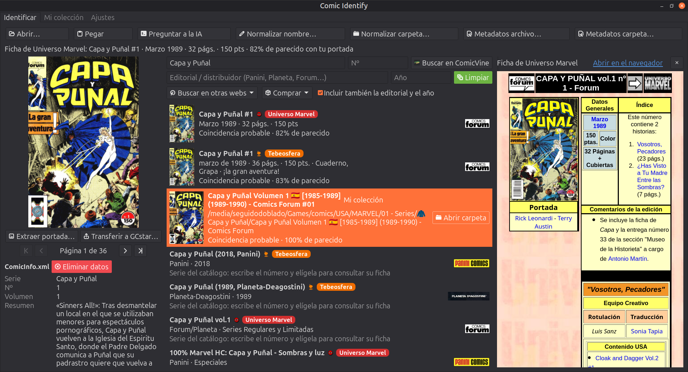

<a href="README.md">🇪🇸 Español</a>

  

<h1 align="center">Comic Identify</h1>

  
  
  
  
  
  
  
  
  
  
  
  

  Identify and catalog your digital comic collection (CBR, CBZ, CB7) by cover or by title, with
  Grand Comics Database, Universo Marvel, Tebeosfera and ComicVine.

  

Desktop application (GTK 4 + PyGObject, interface in Spanish and English), for personal use: no server, no account,
everything lives on your own machine.

- **Identifies** a comic from its cover or its title, with Grand Comics Database (GCD), the catalog of
  Spanish-language Marvel editions from [Universo Marvel](https://fichas.universomarvel.com/), the catalog of every
  comic published in Spain from [Tebeosfera](https://www.tebeosfera.com/), ComicVine and your own collection.
- **Normalizes** file and folder names following a configurable pattern, with undo.
- **Writes** `ComicInfo.xml` metadata (the format read by Kavita, Komga and ComicTagger), with undo and data from
  Universo Marvel and Tebeosfera records.
- **Transfers** the cataloged comic to your [GCstar](https://www.gcstar.org/) collection, with its cover.
- **Verified backups** of its indexes and settings, with restore.
- **Finds where to buy** the issue and opens other comic websites.

## Documentation

Full documentation —installation, usage guide, technical specifications, troubleshooting and more— is on the
**[project wiki](https://github.com/seguidodoblado/comic-identify/wiki)** (Spanish and English).

## Third-party data

GCD data is © Grand Comics Database (<https://www.comics.org/>) and is distributed under the
[CC BY-SA 4.0](https://creativecommons.org/licenses/by-sa/4.0/) license. The local index the application generates
is a derivative work and must keep that attribution and license if shared.

Data from [Universo Marvel](https://fichas.universomarvel.com/) records belongs to its authors, and the characters
and publications to their rights holders. The local database is for your personal use: do not redistribute it.

Data from [Tebeosfera](https://www.tebeosfera.com/) belongs to the Tebeosfera cultural association and its
contributors (its texts are distributed under the CC BY-SA 4.0 license and images belong to their rights holders).
The local database is for your personal use.

Data from [Comic Vine](https://comicvine.gamespot.com/) is obtained through its public API; its terms of use
require linking back to its website on any page that uses its data.

## Privacy

Comic Identify has no server or account of its own and does not collect data. What is stored, where, and who it talks to is in the **[privacy policy](PRIVACY.en.md)**.

## License

This project is distributed under the GNU General Public License, version 3 or later (see `COPYING`).
